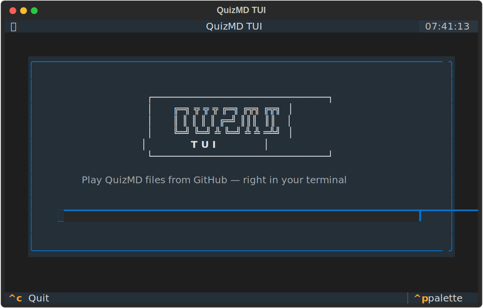
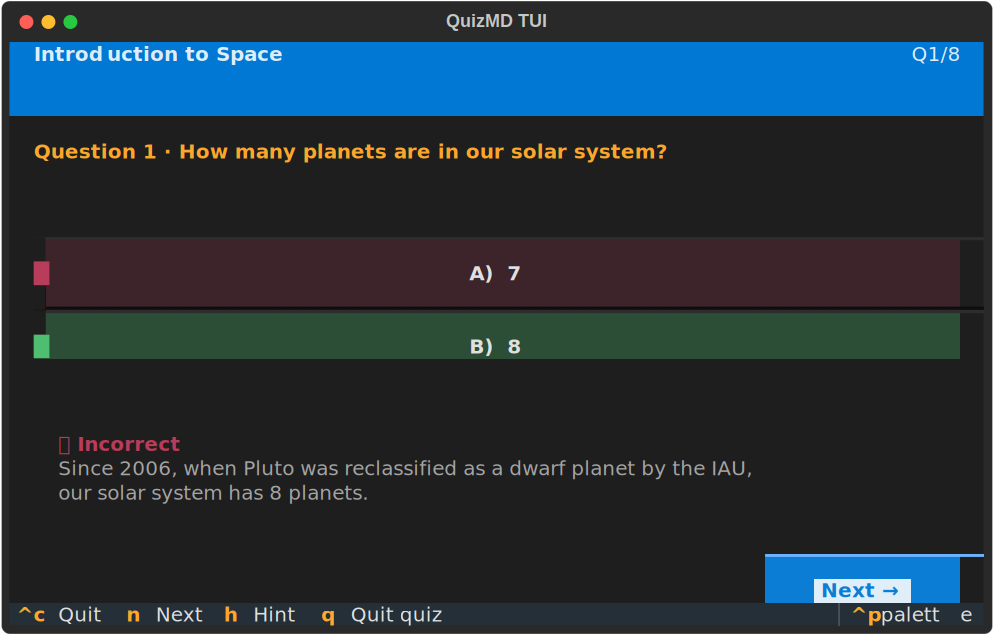

# QuizMD TUI

Play [QuizMD](https://github.com/learnspec/quizmd) quizzes right in your terminal.

Built with [Textual](https://textual.textualize.io/) and [pylearnspec](https://github.com/learnspec/pylearnspec).


<p align="center">
  
</p>

<p align="center">
  
</p>

## Features

- Fetch `.quiz.md` files from any GitHub repo or URL
- Browse repos with multiple quiz files via a built-in file picker
- Play MCQ, multi-select, true/false, and open-answer questions
- Immediate or deferred feedback modes (respects quiz frontmatter)
- Per-question hints, per-choice feedback, and global explanations
- Scoring with pass/fail thresholds
- Question and answer shuffling
- Full results breakdown with replay

## Install

```bash
pip install quizmd-tui
```

Or from source:

```bash
git clone https://github.com/learnspec/quizmd-tui-client.git
cd quizmd-tui-client
pip install -e .
```

## Usage

```bash
# Interactive — enter a source in the TUI
quizmd

# Point to a repo (lists all .quiz.md files)
quizmd learnspec/samples-learnspec

# Point to a specific folder within a repo
quizmd learnspec/samples-learnspec/python-basics

# Point to a specific file
quizmd https://github.com/learnspec/quizmd/blob/main/samples/baroque-music.quiz.md

# GitHub URL with folder path
quizmd https://github.com/learnspec/samples-learnspec/tree/main/music-theory

# Try the bundled sample
quizmd learnspec/quizmd-tui-client
```

Accepted source formats:
- `owner/repo` — browse all quiz files in a repo
- `owner/repo/folder` — browse quiz files in a specific folder
- `https://github.com/owner/repo/tree/branch/folder` — folder via URL
- `https://github.com/owner/repo/blob/branch/file.quiz.md` — single file

A sample quiz is included at [`samples/intro-to-space.quiz.md`](samples/intro-to-space.quiz.md).

## Keyboard shortcuts

| Key     | Action                     |
|---------|----------------------------|
| Enter   | Submit answer              |
| n       | Next question              |
| h       | Show hint (if available)   |
| r       | Replay (on results screen) |
| q       | Quit quiz / go home        |
| Ctrl+C  | Exit                       |

## Supported question types

| Type         | Support |
|--------------|---------|
| MCQ          | Full    |
| Multi-select | Full    |
| True/False   | Full    |
| Open answer  | Full    |
| Match pairs  | Display |
| Order        | Display |

## License

MIT
